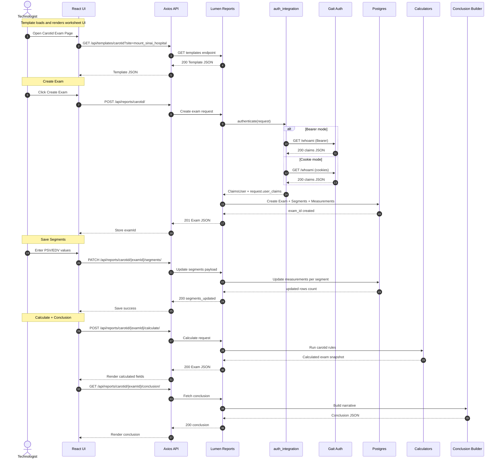

```mermaid
sequenceDiagram
  autonumber
  actor Tech as Technologist
  participant UI as React UI
  participant API as Axios API
  participant DRF as Lumen Reports
  participant AUTH as auth_integration
  participant GAIT as Gait Auth
  participant DB as Postgres
  participant CALC as Calculators
  participant CONC as Conclusion Builder

  Note over Tech,UI: Template loads and renders worksheet UI

  Tech->>UI: Open Carotid Exam Page
  UI->>API: GET /api/templates/carotid?site=mount_sinai_hospital
  API->>DRF: GET templates endpoint
  DRF-->>API: 200 Template JSON
  API-->>UI: Template JSON

  Note over Tech,UI: Create Exam

  Tech->>UI: Click Create Exam
  UI->>API: POST /api/reports/carotid/
  API->>DRF: Create exam request
  DRF->>AUTH: authenticate(request)

  alt Bearer mode
    AUTH->>GAIT: GET /whoami (Bearer)
    GAIT-->>AUTH: 200 claims JSON
  else Cookie mode
    AUTH->>GAIT: GET /whoami (cookies)
    GAIT-->>AUTH: 200 claims JSON
  end

  AUTH-->>DRF: ClaimsUser + request.user_claims
  DRF->>DB: Create Exam + Segments + Measurements
  DB-->>DRF: exam_id created
  DRF-->>API: 201 Exam JSON
  API-->>UI: Store examId

  Note over Tech,UI: Save Segments

  Tech->>UI: Enter PSV/EDV values
  UI->>API: PATCH /api/reports/carotid/{examId}/segments/
  API->>DRF: Update segments payload
  DRF->>DB: Update measurements per segment
  DB-->>DRF: updated rows count
  DRF-->>API: 200 segments_updated
  API-->>UI: Save success

  Note over Tech,UI: Calculate + Conclusion

  UI->>API: POST /api/reports/carotid/{examId}/calculate/
  API->>DRF: Calculate request
  DRF->>CALC: Run carotid rules
  CALC-->>DRF: Calculated exam snapshot
  DRF-->>API: 200 Exam JSON
  API-->>UI: Render calculated fields

  UI->>API: GET /api/reports/carotid/{examId}/conclusion/
  API->>DRF: Fetch conclusion
  DRF->>CONC: Build narrative
  CONC-->>DRF: Conclusion JSON
  DRF-->>API: 200 conclusion
  API-->>UI: Render conclusion


```