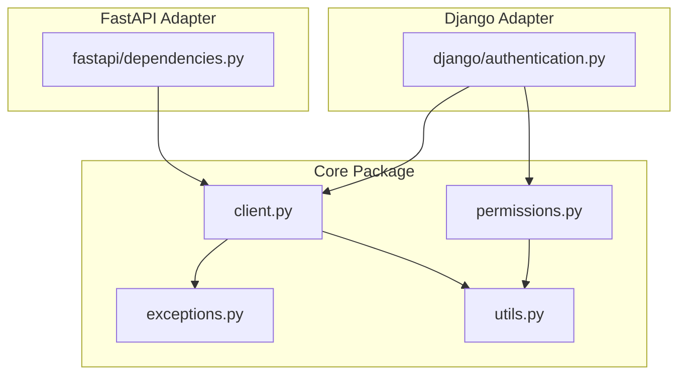
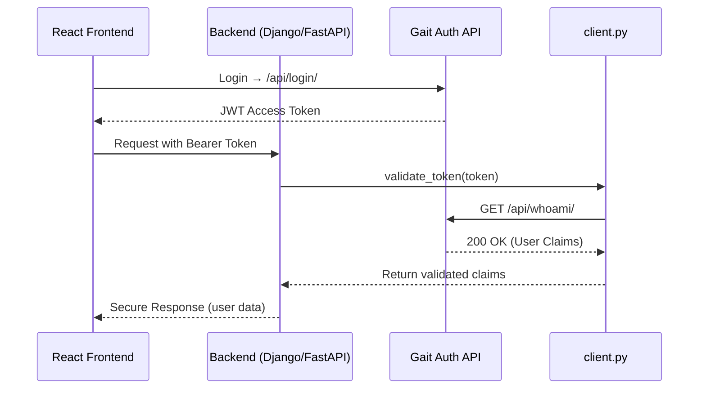

# 🧩 Auth Integration — Module Overview

## Overview
The **Auth Integration** package provides a unified authentication system for Django and FastAPI services that connect to the **Gait Auth API**.

It validates JWTs, extracts user claims, and enforces role-based permissions across all Lumen microservices (Reports, Media, Dubin, HL7, etc.).

---

## 🧠 Architecture Diagram

---

## 📘 Module Responsibilities

| Module | Role | Used By |
|---------|------|---------|
| `client.py` | Async JWT validator calling Gait `/whoami/` | Django & FastAPI |
| `exceptions.py` | Central exception classes for validation errors | All |
| `permissions.py` | Role-based DRF permission classes | Django |
| `utils.py` | Helper utilities for claims & roles | All |
| `django/authentication.py` | Authentication backend for DRF | Django |
| `fastapi/dependencies.py` | Async dependency for route protection | FastAPI |

---

## 🧩 Token Lifecycle

---

Maintained by **Anthony Narine**  
© 2025 — Auth Integration Project
